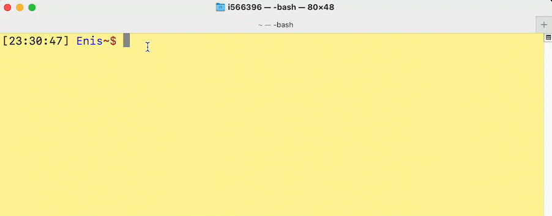

# doviz

This CLI tool gives you the current USD/TRY parity from the terminal. It fetches the parity from doviz.com. 

## Installation

`git clone https://github.com/earik87/doviz`

`cd doviz`

`go install`

## Usage

Type `doviz` in your terminal. It will prompt the current USD/TRY parity.

